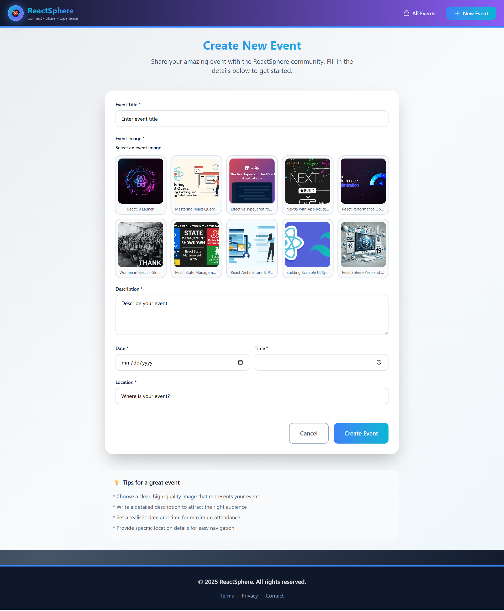
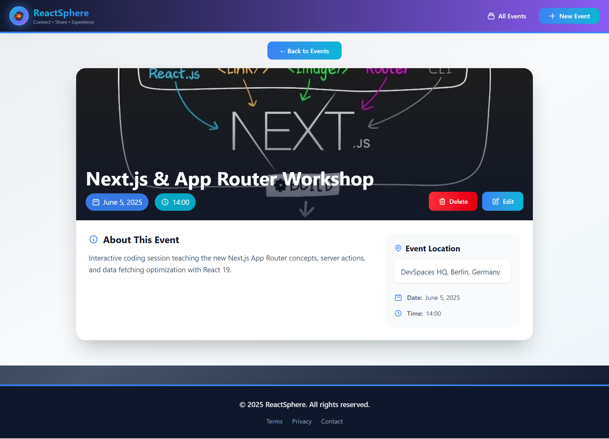
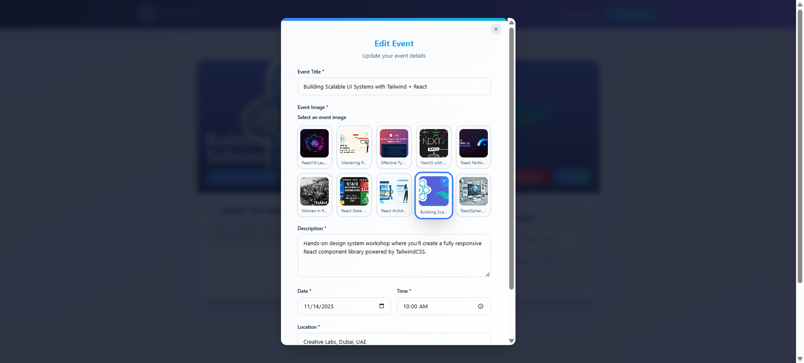

#  React Sphere


**ReactSphere** is a modern web application built to explore and manage developer events and meetups.
It provides a smooth experience for **browsing, searching, creating, and managing events**, powered by **React Router**, **TanStack Query**, and **Tailwind CSS** for a fast, modern UI.

Future Improveme

ReactSphere currently focuses on **Events for React developers**, and I'm mainly working to extend my ReactSphere to include various features like: **Courses**, **Blog**, and other Community features to be as a full developer platform.

I developed a **modular, scalable architecture** that can be easily extended with authentication, pagination, or other ecosystem features.

---

## 🚀 Features

### Frontend
#### **🎯Core Functionality**
- 🧾**Event Management** – Create, edit, delete, and browse events with full CRUD operations.
- 🧭**Dynamic Routing** – Implemented using **React Router**.
- ⚙️**React Router Data APIs** – Loader for fetching event data and Action for handling form submissions and mutations.
- 🔍**Advanced Search** – Filter events by title, location, or description using query parameters (`search`, `max`) with real-time updates.
- 🖼️**Interactive Image Picker** – Clean UI for image selection and preview before submission.
- 🎨**Responsive Design** - Perfect experience across all devices and screen sizes via **Tailwind CSS**

#### **⚡Performance & UX**
- 🗄️**Real-time & Cached Updates** – Achieved through **TanStack Query**’s smart caching, background refetching, and stale-while-revalidate strategy for near real-time sync.
- 🔁**Server State Management** – `useQuery` handles fetching, caching, synchronization, refetching, retries, and states automatically with minimal boilerplate.
- ⚡**Optimistic UI** – Instant feedback on mutations via `useMutation `+ **cache manipulation** (getQueryData, setQueryData, invalidateQueries), ensuring **rollback-safe UX**.
- ⏳**Global Loading Indicator** – Powered by `useIsFetching` and a reusable `<LoadingIndicator />` for unified UX.
- 🚫**Error Boundaries & Fallbacks** – Graceful recovery via `<ErrorBlock />` for both query and mutation errors.


<hr style="border: 1px solid #ccc; margin: 20px auto; width: 90%;" />

### 🏗️ Backend

- ⚙️ **Implemented with Node.js + Express (used as a ready backend source)**
- 🔌 Uses a **prebuilt REST API** for fetching and managing events
- 📂 **JSON file storage** (easy to replace with DB)
- 🌐 Endpoints for retrieving, creating, updating, and deleting events
- 🔁 Ready to extend with database or cloud deployment

---

## 🛠️ Tech Stack

### 🖥️ Frontend

- **React 19.2.0**
  - Hooks: `useState`, `useRef`, `useEffect`
  - **Portals**, **forwardRef**, and **useImperativeHandle** for modal rendering
- **React Router v6+**
  - `createBrowserRouter` + RouterProvider with Route Objects.
  - Nested routes & Layouts with `<Outlet />`
  - Index route (only one per parent)
  - Navigation: `<Link>`, `<NavLink>`, `useNavigate`, `redirect`
  - Dynamic routes (:id) + `useParams`
  - `useNavigation` for pending UI
- **TanStack Query v5**
  - Server state management with caching & synchronization
  - `useQuery` for reading/fetching server data and handles caching, synchronization, refetching, retries, and states automatically
  - `useMutation` for performing create/update/delete operations against the server
  - `useIsFetching` for global loading indicator
  - **Core Cache Manipulation methods** like: `getQueryData()`, `cancelQueries()`, `setQueryData()`, `invalidateQueries()` and `fetchQuery()` used in Optimistic UI Updates
- **FormData** API for form submissions
- **JavaScript (ES6+)**
- **TailwindCSS** for styling and responsive design
- **Vite** for development and build

<hr style="border: 1px solid #ccc; margin: 20px auto; width: 90%;" />

### 🏗️ Architecture

- 🧱 **Feature-based architecture** for scalability and maintainability.
- **Separation of Concerns** - Clear boundaries between UI, state, and data layers
- **Component Reusability** - Shared UI components like: `<ErrorBlock />`, `<LoadingIndicator />` ... , and shared layout `<RootLaout />`, `<Header />`, and `<Footer />`

<hr style="border: 1px solid #ccc; margin: 20px auto; width: 90%;" />

### ⚡Advanced Features & Patterns

### 🧭 Controlled & Uncontrolled Modal Pattern

ReactSphere’s `Modal` component implements **both controlled and uncontrolled behaviors**, supports **controlled mode** via the `open` prop and **uncontrolled mode** via ref methods: `open()`, `close()`, and can be used flexibly depending on how the parent component manages state

#### 🧩 Controlled Mode:
  In this mode, the parent explicitly manages the modal’s open/close state:
  ```jsx
  <Modal open={isModalOpen}>
    <Form />
  </Modal>
  ```
  Internally, the `useEffect` hook listens to changes in the `open` prop and updates the native `<dialog>` accordingly.

#### 🔄 Uncontrolled Mode:
  In this mode, the parent accesses modal control methods through a ref:
  ```jsx
  const modalRef = useRef();

  <Modal ref={modalRef}>...</Modal>

  // Somewhere else
  modalRef.current.open();   // opens programmatically
  modalRef.current.close();  // closes programmatically
  ```
  This is enabled via `useImperativeHandle`, exposing the `open()` and `close()` methods for flexible usage.

<hr style="border: 1px solid #ccc; margin: 20px auto; width: 90%;" />

### ⚡ Optimistic UI Updates (Edit Event Page)

ReactSphere also implements **optimistic updates** with Tanstack Query — a powerful UX enhancement that immediately reflects user actions while the server request is still pending.

  #### 🧠 How It Works

  When editing an event, the app:

  1. Instantly updates the local cache to reflect the edited event (`onMutate`)
  2. Cancels any outgoing queries for that event (`cancelQueries`)
  3. Rolls back to the previous state if the update fails (`onError`)
  4. Revalidates after success to ensure consistency (`invalidateQueries`)

  ```jsx
    const { mutate } = useMutation({
      mutationFn: updateEvent,
      onMutate: async (data) => {
        const newData = data.event;
        await queryClient.cancelQueries({ queryKey: ["events", eventId] });
        const previousEvent = queryClient.getQueryData(["events", eventId]);
        queryClient.setQueryData(["events", eventId], newData);

        return { previousEvent };
      },
      onError: (error, data, context) => {
        queryClient.setQueryData(["events", eventId], context.previousEvent);
      },
      onSettled: () => {
        queryClient.invalidateQueries(["events", eventId]);
      },
    });

  ```
  🪄 **Result**: Immediate UI updates → rollback on failure → auto-refresh on success.


<hr style="border: 1px solid #ccc; margin: 20px auto; width: 90%;" />

### 🔍 Smart Event Search (Dynamic Query with React Query)

ReactSphere includes a **real-time search feature** that allows users to find events dynamically based on title, location, or description.

  #### ⚙️ Implementation Details

  - Uses **React Query’s dynamic keys** (`["events", { search: searchTerm }]`) to re-fetch automatically when the search term changes.
  - Enables conditional fetching with the `enabled` option — only queries when a term is entered.
  - Supports optional query parameters (`search`, `max`) to limit results or refine filtering from the backend.
  - Integrates **AbortController** automatically (through React Query’s `signal` argument) for request cancellation when typing new queries.
  - Clean UX states: loading spinner, error fallback, empty state, and result grid.

  ```jsx
  const { data, isLoading, isError, error } = useQuery({
    queryKey: ["events", { search: searchTerm }],
    queryFn: ({ signal }) => fetchEvents({ signal, searchTerm }),
    enabled: searchTerm !== "",
  });

  ```
<hr style="border: 1px solid #ccc; margin: 20px auto; width: 90%;" />

### 🛠️ Backend

- Node.js
- Express.js for creating REST API endpoints
- JSON files for data storage (events.json and images.json)

---

## 📂 Project Structure

### Frontend Structure

```text
react-sphere/frontend/
├── App.jsx                        # Root app component (sets up routes and layout)
├── index.css                      # Global styles & Tailwind base imports
├── main.jsx                       # App entry point (renders <App />)
├── queryClient.js                 # React Query client configuration
├── router.jsx                     # Main router setup (defines route hierarchy)

├── assets/                        # Static assets (logos, images)
│   ├── logo.png
│   └── meetup.jpg

├── features/                      # Domain-based feature modules
│   └── events/                    # Events feature
│       ├── api/                   # API and data fetching logic
│       │   └── http.js
│       ├── components/            # UI and functional components for events
│       │   ├── EventForm.jsx
│       │   ├── EventItem.jsx
│       │   ├── EventsIntroSection.jsx
│       │   ├── FindEventSection.jsx
│       │   └── NewEventsSection.jsx
│       ├── pages/                 # Page components (used in routing)
│       │   ├── EditEventPage.jsx
│       │   ├── EventDetailsPage.jsx
│       │   ├── EventsPage.jsx
│       │   └── NewEventPage.jsx
│       └── router/                # Route-level logic (loaders, actions, routes)
│           ├── eventsActions.js
│           ├── eventsLoaders.js
│           └── eventsRoutes.jsx

├── shared/                        # Reusable shared modules
│   ├── components/                # Shared UI elements
│   │   └── ui/
│   │       ├── ErrorBlock.jsx
│   │       ├── ImagePicker.jsx
│   │       ├── LoadingIndicator.jsx
│   │       └── Modal.jsx
│   └── layouts/                   # Layout components (header, footer, root)
│       ├── Footer.jsx
│       ├── Header.jsx
│       └── RootLayout.jsx
└─
```

---

## ⚙️ Installation & Usage

### Running Frontend

Clone the repository, install frontend dependencies, and start the frontend server

```bash
git clone git@github.com:smadi2512/react-sphere.git
cd react-sphere
cd frontend
npm install
npm run dev
```

**Note**: The frontend will run on http://localhost:5173

### Running Backend

In a new terminal, navigate to the backend directory, install its dependencies, and start the backend server:

```bash
cd backend
npm install
npm start
```

**Note**: The backend will run on http://localhost:3000

---

## 📸 Screenshots

<table align="center">
  <tr>
    <td>
      <h4 align="center">ReactSphere Home page</h4>
      
    </td>
    <td>
      <h4 align="center">ReactSphere Search section</h4>
      
    </td>
    <td>
      <h4 align="center">ReactSphere New Event page</h4>
      
    </td>
  </tr>
  <tr>
    <td>
      <h4 align="center">ReactSphere with Event's details page</h4>
      
    </td>
    <td>
      <h4 align="center">ReactSphere with Event's edit feature</h4>
      
    </td>
    <td>
      <h4 align="center">ReactSphere with Event's delete feature</h4>
      
    </td>
  </tr>
</table>

---

## 🧩 Future Improvements

Planned enhancements and upcoming features to make ReactSphere more powerful, dynamic, and user-friendly 🔮

- 🗂️ **File Upload** - Dynamic image upload with preview & drag-and-drop instead of pre-defined images
- 🔐 **User authentication** and role-based access (Admin, Organizer, Attendee)
- 🏷️ **Event Categories** - Classify events by type (Workshops, Meetups, Talks) for better organization and discovery.
- 📝 **Comments and reviews** on events
- 🌍 **Pagination and filtering**
- 🧑‍🤝‍🧑 **Community section** - (Discussions, Blog, Courses) to expand into a full developer hub.
- 🔄 Add **debounced search input** for smoother UX
- 🌗 Add **dark mode** and UI transitions
- 🧾 Connect to a **real database** backend API instead of JSON storage
- 🧠 **TypeScript Migration** - Full type safety implementation
- 📅 **Calendar View** - Visual event scheduling with an interactive calendar interface.
- 📢 **Social Features** - Event sharing, invites, and user interactions
- 📧 **Email Notifications** - Event reminders and updates
- ⚡ **Real-time Features** - WebSocket integration for live updates


---

## 👩‍💻 Author

Created by **Walaa Smadi**✨ \
Passionate React developer building modern, maintainable, scalable, performant, and user-friendly web apps.

- 📧 Email: [walasmadi93@gmail.com](mailto:walasmadi93@gmail.com)
- 💼 LinkedIn: [Walaa Smadi](https://www.linkedin.com/in/walaa-bilal-smadi/)
- 🐙 GitHub: [@smadi2512](https://github.com/smadi2512)

Feel free to fork, star ⭐, and contribute!